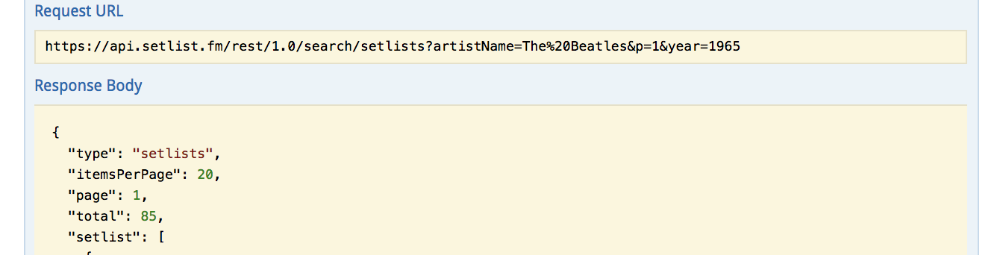

# Querying an API

In this lab, we will practice following the ETL (extract, transform, load) pattern to pull data from an external API, manipulate the data so we can use it, and finally make Python objects with the data.  We will walk through obtaining JSON from an API and converting that JSON into objects we can use in our applications.  All APIs aren't exactly the same, but we will understand the general flow for accessing API data by the end of this lab.

## Objectives

* Understand how to create a personal key to gain access to an API's data
* Understand how to clean the data and create Python objects from it

## Beatles Concerts

We will be working with the [setlist.fm](https://api.setlist.fm/docs/1.0/index.html) API to obtain information about Beatles concerts from 1965!  First, we'll need to be authorized to access this data before we can worry about setting up our models and relationships that we'll use later on to make related objects.  


### Part 1: Extract

As with most APIs, setlist.fm requires us to create an account and apply for our own API key to access its data.  Go to the link above and click on "register first" to fill out a form for creating an account.  Check your email for a message asking to confirm the newly created account.

Once confirmation is complete, we can go back to the link above to "apply for an API key".  Fill out this form and we'll be assigned our very own, unique access token.

Sweet! Now let's test our API key.  Click on the "Try it out!" button underneath the Resources header.  Now we can add our API key to the input field at the top part of the page.

Let's try getting data on Beatles concerts from the 1965.  Under `/1.0/search/setlists`, set the search parameters for `artistName` to "The Beatles", `p` to 1, and `year` to 1965, respectively.  Also, we want our response data to be in the JSON format, so let's set the "Response Content Type" dropdown to "application/json".  Now, click on "Try it out!"



Awesome!  Our request seems to be working properly.

### Creating a `config.py` and `setlist_data.py`

Now that we know that our API key is working, we will make our request in the `setlist_data.py` file so that our program can access the API's data.  To do so, we'll need to use our API key.

#### Hiding the API key
>**Important:** Just as with a password, we never want to publish our private API key to a public place like Github because nefarious actors could do something bad using it without our knowledge.

Create a `config.py` file and add a variable containing a string of your API key like so:

> `token = 'your-api-key-goes-here'`

We have already added `config.py` to our `.gitignore` file so that our secret token will not be published to Github. Remember that any file named in our `.gitignore` will not be pushed to our github repository. In `setlist_data.py`, where we will make the API request, we can import the config file and use our API token while still keeping it a secret from the public.

We need to import requests at the top of `setlist_data.py` to handle our API request.  Just as we did in our test run above, we will want to make the same GET request with headers for accepting a JSON response and our API key.  We can pass these into our GET request by means of a dictionary, as we can see below.  The token variable comes from our hidden config file.

```python
headers = {'Accept': 'application/json', 'x-api-key': token}

response = requests.get('https://api.setlist.fm/rest/1.0/search/setlists?artistName=The%20Beatles&p=1&year=1965', headers=headers)
raw_data = json.loads(response.content)
```


Uncomment the debugger in the middle of the file to play around with out response data.  If we look at `response.content`, we see that the content of response variable above is one long JSON string.  We want to work with the dictionary inside that string, which is why we need to `import json` at the top of the file and use `json.loads` to transform our response's content into a format we can work with later.

### Part 2: Transform

Take another look at the `raw_data` -- it is one long dictionary. However, we are interested in the setlist data for each concert. How can we pull only the setlist information from this object?  We want our `data` variable to point to a list of dictionaries, with each dictionary representing the data for one concert. 

Once we have our list of setlist dictionaries, let's create our models! We will be working with a simple "has many" and "belongs to" relationship.  An Artist, in this case, the Beatles, will have many Shows - the shows from 1965 returned to us in our JSON response.

#### `artist.py`

Our Artist model should be initialized with a `name`.  Make a setter and getter for the name property.

Artist should have a class variable, `_all`, which will be a list containing all instances of our Artist class.  Upon initialization, each new instance should be added to the `_all` list.  Also, let's create a class method called `all` that returns all of these stored instances.

Then, we should make an instance method `shows` that will return all of the shows belonging to that instance of the Artist class.

> **Note:** We need to search through `Show.all()` to accomplish this, which is why we are importing Show at the top of the file

Lastly, we'll create one last class method, `find_by_name`, which will take an artist's name and return this artist's Artist instance if it exists in `cls.all()`.

#### `show.py`


A Show should be instantiated with an `artist` (which will be an instance of the Artist class), a `date`, a `venue`, a `location`, and a `setlist`.  Make setters and getters for each of these attributes.

Like the Artist model, we'll want to create a `_all` class variable that keeps track of every Show instance and an `all` class method for reading all of these instances.  We do this so we'll be able to call `Show.all()` as described in the note from above.


### Part 3: Transform (some more) and Load (sort of)

#### `etl.py`

Once our models are set, we are finally ready to work with out `data` from the API and use it to create Artist and Show objects!  At the top of `etl.py`, we have already imported our Artist and Show classes as well as our `data` that we pulled from the API.

First, write a method called `find_or_create_artist` that accepts an artist name as a parameter.  If an Artist instance of that name exists, it will return that object. Otherwise, it will create a new Artist instance with that name and return it.

Second, write a method called `make_show_objects` that accepts `data` as an argument.  Remember that `data` points to a list of dictionaries, and each dictionary represents the data for one show.  We'll loop through each element in the `data` list and create a new instance of Show using the data found within that element.

Recall from above that a Show is instantiated with an artist (instance), a date, a venue, a location, and a setlist.  We can call our recently created `find_or_create_artist` function to set the artist attribute for each Show instance.  We can pull the date and the venue name directly from the `data`, but we'll need to perform some operations to coerce the plain data into the format we want for location and setlist.

Each location should be in the following format: "City, State".

And each setlist should be a list containing all of the song names performed at that concert.

## A Note on True Load

Nice job!  In this lab, we registered for an API key and used it to obtain JSON data from an API.  Then, we created models having a "has many" and "belongs to" relationship.  Lastly, we created instances of these models with our transformed API data.

However, let's think about what is actually happening here.  Every time we use this app, we need to make a GET request to the API and create new objects.  This process takes a lot of time.  What will happen when we work with large amounts of data?

Furthermore, what if we want to make changes to the data we pull from the external API?  How can we persist these changes so that they become the new baseline for the next time we use the app?

In the next section, we will learn how to use relational databases to persist this data.  We will be able to get data from an external API, clean it, use it how we want, and save it onto our own database so that we can use it again later on.  That way, we can make one GET request to the external API to load (for real this time) our database, and we can use this database to make any changes we want on this data.
